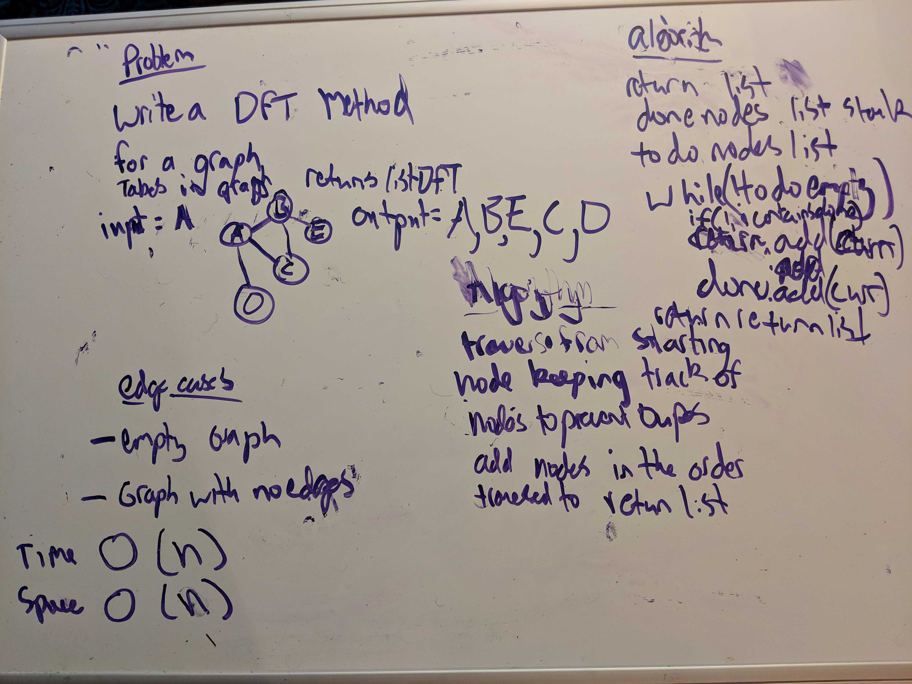

# GraphsDepthFirst

Code Challenge 28 DepthFirst
## Challenge
Create a function that accepts an adjacency list as a graph, and conducts a depth first traversal. Without utilizing any of the built-in methods available to your language, return a collection of nodes in their pre-order depth-first traversal order.

## Approach & Efficiency
Depth First Traversal (or Search) for a graph is similar to Depth First Traversal of a tree. The only catch here is, unlike trees, graphs may contain cycles, so we may come to the same node again. To avoid processing a node more than once, we use a boolean visited array. Same as the BFS except with LIFO FIFO swapped

### Space Efficiency
O(n)

### Time Efficiency:
O(n)

