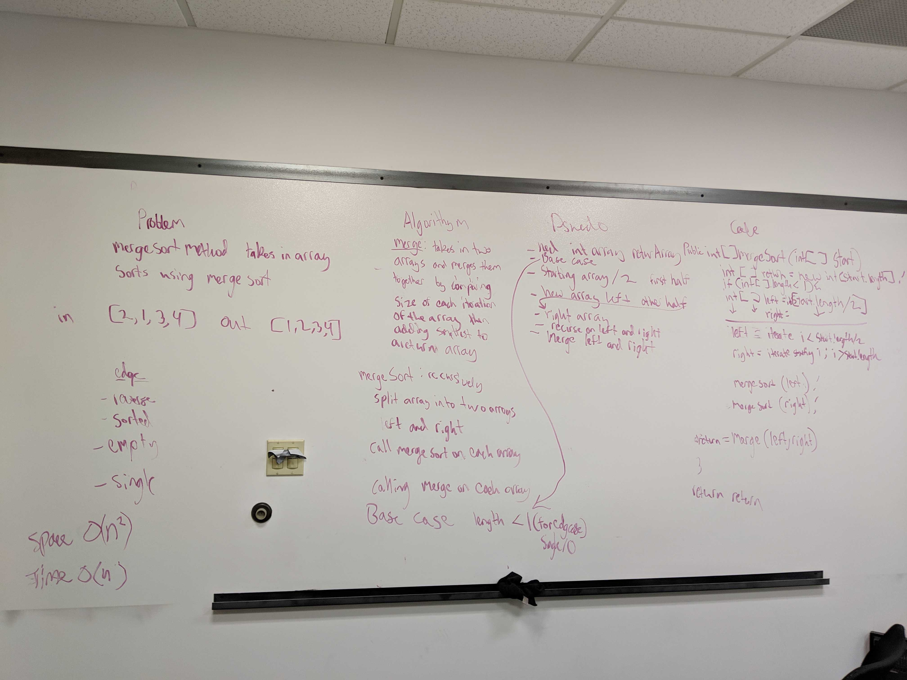

# MergeSort
Code Challenge 36 MergeSort

## Challenge
Write a function that accepts an array of unsorted integers, and returns a sorted array by a recursive mergesort algorithm.

## Approach & Efficiency
recursively split into two arrays and call merge method on each half returning a new array

## Solution
Time: O(N)
Space: O(N^2)

