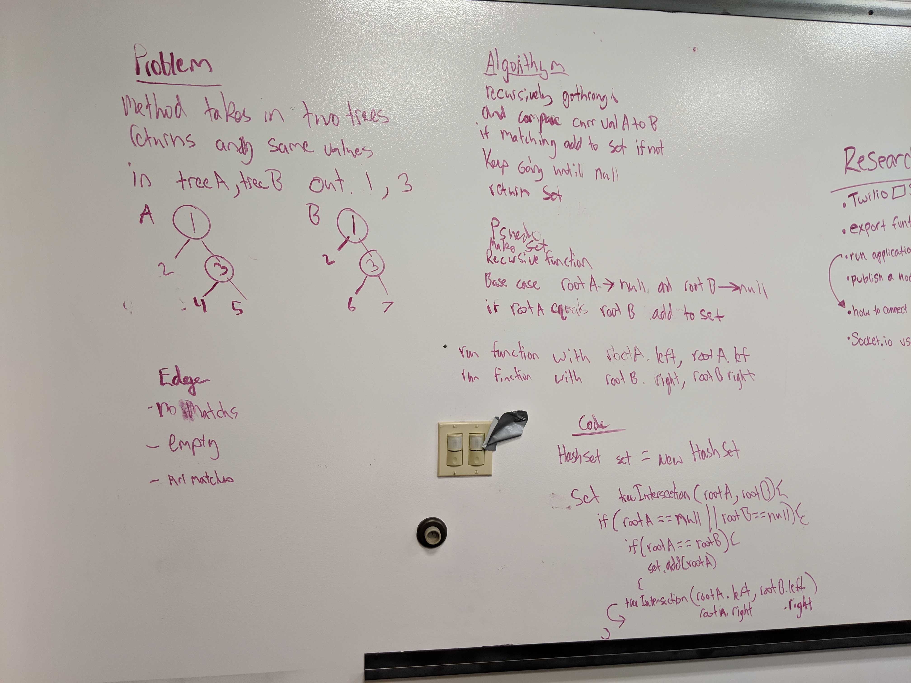

# Intersection of binary trees
Code Challenge 32

## Challenge
Write a function called tree_intersection that takes two binary tree parameters.
Without utilizing any of the built-in library methods available to your language, return a set of values found in both trees.
## Approach & Efficiency
recursively iterate through both trees at the same time comparing values and adding matches to a return set.

## Solution
Time: O(N)
Space: O(N)

